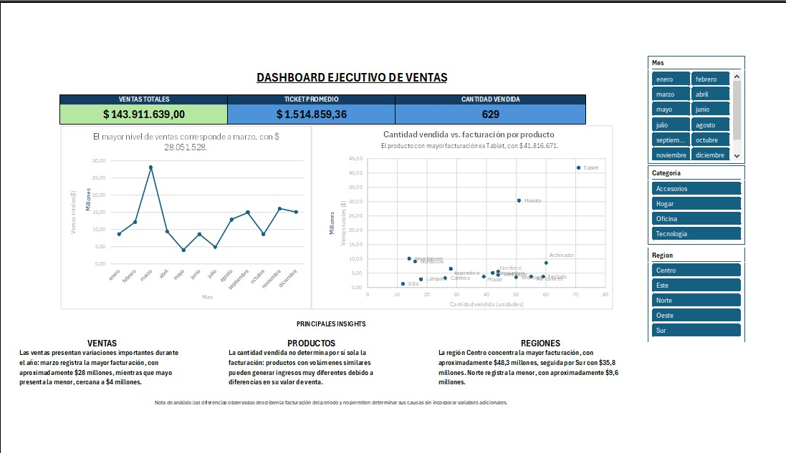
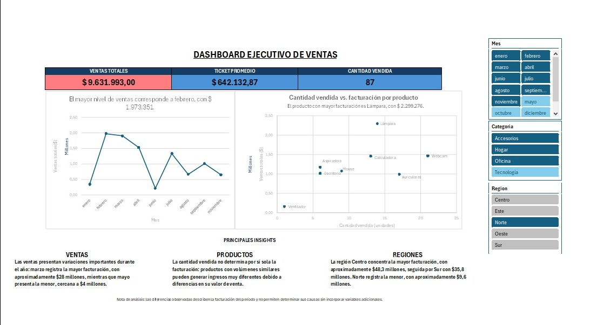

# TP9 - Dashboard Final de Inteligencia de Negocios - Coderhouse

## Descripción del proyecto

Este repositorio contiene la entrega del TP9 del curso de Análisis de Datos de Coderhouse.

El proyecto integra el flujo analítico desarrollado en los módulos anteriores y presenta una capa final de visualización ejecutiva en Excel, combinando procesamiento de datos, modelo de datos, medidas DAX, análisis estadístico, escenarios, visualizaciones interactivas y validación de insights mediante Inteligencia Artificial.

## Archivo principal

`TP9_Dashboard_Final_BianchiGisela.xlsx`

El libro contiene el modelo analítico y la hoja `Dashboard Final`, diseñada como reporte ejecutivo interactivo.

---

## Arquitectura técnica del proyecto

### 1. ETL - Power Query / Lenguaje M

El libro contiene cuatro consultas de Power Query:

- `Datos_Crudos_Transacciones`
- `Dim_Calendario`
- `Dim_Clientes`
- `Dim_Productos`

La consulta transaccional realiza, entre otras operaciones:

- Importación de datos desde CSV.
- Promoción de encabezados.
- Creación de `ID_Transaccion`.
- Definición de tipos de datos.
- Validación de registros.
- Normalización de textos.
- Combinación con las dimensiones de Productos y Clientes.
- Incorporación de `ID_Producto` e `ID_Cliente`.

El código M incluye pasos identificados y comentados para facilitar su inspección desde el Editor Avanzado de Power Query.

### 2. Modelo de datos - Power Pivot

El modelo utiliza una estructura dimensional con:

- `Datos_Crudos_Transacciones` como tabla transaccional central.
- `Dim_Productos`
- `Dim_Clientes`
- `Dim_Calendario`

Las dimensiones se encuentran relacionadas con la tabla transaccional mediante relaciones `1:N`, permitiendo aplicar filtros desde las dimensiones hacia los datos de ventas.

### 3. Medidas DAX

El modelo contiene medidas DAX utilizadas por los elementos analíticos y visuales del reporte.

Se implementaron cálculos para indicadores como:

- Ventas Totales.
- Cantidad Vendida.
- Ticket Promedio.

El modelo incluye medidas estructuradas mediante DAX y cálculos con `VAR` / `RETURN`.

### 4. Análisis estadístico y escenarios

El libro conserva las capas analíticas desarrolladas en módulos anteriores, incluyendo:

- Hoja `Estadistica_Descriptiva`.
- Hoja `Resumen del escenario`.
- Hoja `Analisis_Modelo`.
- Modelo de datos utilizado como base del reporte ejecutivo.

---

## Dashboard Final

La hoja `Dashboard Final` presenta una interfaz ejecutiva orientada al análisis de ventas.

### KPIs

- Ventas Totales.
- Ticket Promedio.
- Cantidad Vendida.

El KPI de Ventas Totales incorpora formato condicional dinámico según el cumplimiento de una meta definida.

### Interactividad

El dashboard contiene tres segmentadores:

- Mes.
- Categoría.
- Región.

Los segmentadores están conectados a los elementos correspondientes del dashboard y permiten actualizar dinámicamente los indicadores y visualizaciones.

### Visualizaciones

El reporte incluye:

- Evolución mensual de ventas.
- Gráfico de dispersión `Cantidad vendida vs. facturación por producto`.

El gráfico de dispersión permite analizar la relación entre volumen vendido y facturación y cumple la función de gráfico avanzado de la entrega.

### Narrativa dinámica

El dashboard incorpora elementos narrativos que se modifican según los filtros aplicados.

Entre ellos:

- Título dinámico sobre la evolución mensual.
- Insight dinámico que identifica el producto con mayor facturación dentro del contexto filtrado.

Esto permite que la interpretación visual acompañe los cambios producidos por los segmentadores.

---

## Insights y validación con Inteligencia Artificial

El dashboard presenta conclusiones relacionadas con:

- Evolución mensual de las ventas.
- Relación entre cantidad vendida y facturación por producto.
- Diferencias de facturación entre regiones.

ChatGPT fue utilizado como herramienta de apoyo para realizar una revisión crítica de las conclusiones mediante una estrategia de “abogado del diablo”.

El análisis permitió identificar posibles sesgos, variables omitidas y explicaciones alternativas.

A partir de esta revisión:

- Se evitaron atribuciones causales no demostradas por los datos.
- Se reformularon los insights.
- Se incorporó una nota metodológica.
- Se reforzó la narrativa dinámica del dashboard.

La documentación completa se encuentra en:

`Documentacion_Uso_IA_TP9_BianchiGisela.pdf`

y dentro del libro en la hoja oculta:

`Documentacion_IA`

---

## Fuentes de datos

La carpeta `Fuentes` contiene:

- `Datos_Crudos_Transacciones.csv`
- `Tablas_Maestras_TP8.xlsx`

Estos archivos corresponden a los orígenes utilizados en el desarrollo del modelo y se incluyen para permitir su inspección.

Las consultas conservan la configuración de origen utilizada durante el desarrollo. Si Excel solicita localizar nuevamente un archivo fuente al intentar actualizar una consulta en otro equipo, se deben seleccionar las copias disponibles en la carpeta `Fuentes`.

---

## Evidencias verificables

La carpeta `Evidencias` contiene capturas destinadas a facilitar la revisión técnica de la entrega.

Se documentan evidencias del:

- Dashboard Final.
- Funcionamiento de los segmentadores.
- Actualización dinámica de KPIs y visualizaciones.
- Narrativa dinámica.

También pueden verificarse directamente dentro del Excel:

- Consultas y transformaciones de Power Query.
- Código M desde el Editor Avanzado.
- Modelo y relaciones desde Power Pivot.
- Medidas DAX.
- Estadística descriptiva y escenarios.
- Dashboard interactivo.
- Documentación del uso de IA.

### Evidencias visuales de la rúbrica

#### Dashboard Final - Diseño UI y KPIs

Esta captura evidencia el diseño ejecutivo del dashboard, los tres KPIs, los tres segmentadores, las visualizaciones, el gráfico avanzado de dispersión y la capa narrativa.

#### Interactividad - Segmentadores conectados

Esta captura evidencia el funcionamiento de los segmentadores. Al seleccionar la Región Norte se actualizan los KPIs, los gráficos y los elementos narrativos dinámicos.

---

## Instrucciones de verificación

1. Descargar `TP9_Dashboard_Final_BianchiGisela.xlsx`.
2. Abrirlo con Microsoft Excel de escritorio.
3. Ingresar a la hoja `Dashboard Final`.
4. Utilizar los segmentadores de Mes, Categoría y Región.
5. Comprobar la actualización de KPIs, gráficos y narrativa dinámica.
6. Para inspeccionar el ETL, ingresar en `Datos > Consultas y conexiones`.
7. Para revisar el modelo y las medidas, ingresar en `Power Pivot > Administrar`.
8. Consultar `Documentacion_Uso_IA_TP9_BianchiGisela.pdf` para revisar los prompts, el análisis crítico y la validación de insights.

---

**Autora:** María Gisela Bianchi  
**Curso:** Análisis de Datos - Coderhouse  
**Entrega:** TP9 - Dashboard Final
